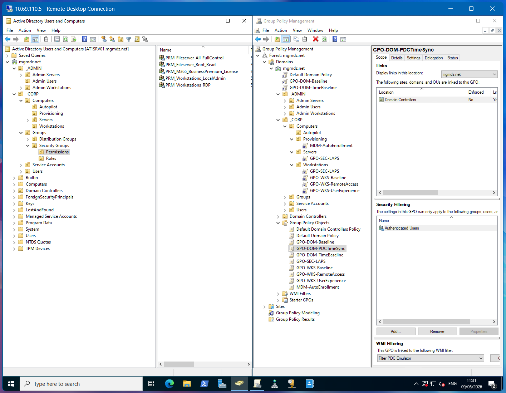
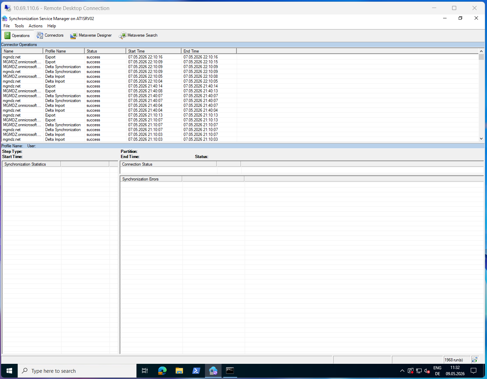

# MGMDZ - Corporate Homelab
"Man geht mit der Zeit oder man geht mit der Zeit"

A personal lab environment built to design, document, and operate an enterprise-style hybrid identity platform end-to-end — on-premises Active Directory, Microsoft Entra ID, Windows Autopilot, GPO-based hardening, segmented networking, and tiered administration.

> **Status:** Active development — see [Roadmap](#roadmap).
> **Purpose:** Self-study and skill demonstration. All data is fictional.

---

## Architecture and Roadmap

> The lab also runs separate VLANs for Home, IoT, Camera, and Guest networks. These are isolated from the corporate lab segments by default and documented in [Network Design](docs/01-network-design.md).

---

## Screenshots
<table style="width: 100%; border-collapse: collapse;">
  <tr>
    <td align="center" width="33%">
       
      <b>Screenshot Domain Controller incl. OUs and GPOs</b>
    </td>
    <td align="center" width="33%">
       
      <b>Screenshot Entra Connect incl. Synchronization Service Manager</b>
    </td>
    <td align="center" width="33%">
       
      <b>Screenshot ODJ Connector incl. Event Viewer and Services.msc</b>
    </td>
  </tr>
</table>

---

## What this lab demonstrates

- **Hybrid identity** — on-prem Active Directory ↔ Microsoft Entra ID via Entra Connect Sync (Password Hash Sync)
- **Windows Autopilot** in a Hybrid Azure AD Join scenario, fronted by an ODJ Connector
- **Structured AD design** — Top-Level-OU principle, AGDLP-style RBAC with `ROL_` / `PRM_` group prefixes, intentional sync-scope separation between `_CORP` and `_ADMIN`
- **Group Policy hardening** — domain baseline, LAPS with custom managed admin account, RDP hardening, workstation baseline, restricted-groups model
- **Tiered administration** — Tier 0 / 1 / 2 separation with dedicated admin accounts and PAW concept
- **Network segmentation** — VLAN-based isolation between corporate, home, IoT, camera, and guest networks; WireGuard VPN with scoped access to the lab segment only
- **Documentation as infrastructure** — every layer is documented, versioned, and reviewable

---

## Environment

| Layer | Component | Notes |
|-------|-----------|-------|
| Hypervisor | Proxmox VE on Lenovo ThinkCentre M920q | Single-host setup, two-tier storage (NVMe / SSD) |
| Network | UniFi (UDM/USW), WireGuard VPN | 9 VLANs, scoped firewall rules, segmented inter-VLAN routing |
| Domain | `corp.lab` (AD-integrated DNS) | Single forest, single domain |
| Identity sync | Microsoft Entra Connect Sync (PHS) | Scope: `_CORP` OU only — `_ADMIN` excluded |
| Endpoint provisioning | Windows Autopilot (Hybrid Azure AD Join) | ODJ Connector writing to dedicated staging OU |
| Endpoint policy | GPO + Windows LAPS | AppLocker in audit mode; LAPS with custom managed admin |
| Cloud licensing | Microsoft 365 Business Premium | Includes Intune Plan 1, Entra ID P1, Autopilot, Defender |

### VM register (corporate lab segment)

| Name | Role | VLAN | IP | OS |
|------|------|----:|----|----|
| `AT1SRV01` | Domain Controller, DNS, DHCP | 110 | 10.69.110.5 | Windows Server 2022 |
| `AT1SRV02` | Entra Connect Sync | 110 | 10.69.110.6 | Windows Server 2022 |
| `AT1SRV04` | ODJ Connector | 110 | 10.69.110.8 | Windows Server 2022 |
| `AT1WKS01` | Corporate workstation | 120 | DHCP | Windows 11 Enterprise |

Templates for Windows Server 2022 and Windows 11 Enterprise are kept on the Tier-0 storage pool for fast cloning.

---

## Documentation

| Topic | Document |
|-------|----------|
| Standards & inventory (naming, VM IDs, asset DB, Proxmox sizing tiers) | [docs/inventory-standards.md](docs/inventory-standards.md) |
| Network design (VLANs, firewall, WireGuard, known limitations) | [docs/01-network-design.md](docs/01-network-design.md) |
| Active Directory & identity (OU hierarchy, RBAC, tiering, GPOs, Entra Connect) | [docs/02-active-directory.md](docs/02-active-directory.md) |
| Hybrid identity deep-dive (Entra Connect, SCP, sync scope) | *Planned* |
| Autopilot Hybrid Join walkthrough | *Planned* |
| Step-by-step GPO build guides | *Planned* (`gpos/*.md`) |

---

## Roadmap

### In place

- [x] Proxmox host with VLAN-aware bridge, two-tier storage layout
- [x] UniFi VLAN segmentation, firewall rules, WireGuard VPN with scoped access
- [x] Domain Controller, OU hierarchy, AGDLP-style RBAC, tiered admin model
- [x] Entra Connect Sync (PHS) with `_CORP`-only sync scope
- [x] ODJ Connector for Autopilot Hybrid Azure AD Join
- [x] First Windows 11 client enrolled via Autopilot, verified via `dsregcmd /status`
- [x] GPOs implemented: `GPO-DOM-Baseline`, `GPO-SEC-LAPS`, `GPO-WKS-Baseline`, `GPO-WKS-RemoteAccess`, `GPO-WKS-UserExperience`

### Next up

- [ ] Server baseline GPO (`GPO-SRV-Baseline`)
- [ ] Admin Servers baseline + hardening (`GPO-ADM-*`)
- [ ] PAW build under `_ADMIN\Admin Workstations` with `GPO-PAW-Hardening`
- [ ] LAPS authorized-decryptor group (`G-SEC-LAPS-Admins`)
- [ ] Tier-0 isolation: dedicated VLAN and storage for `AT1SRV02`
- [ ] Intune configuration profiles for Autopilot-enrolled clients
- [ ] Windows Event Forwarding to a central collector
- [ ] Backup schedule and retention policy per storage tier

A more granular per-document roadmap is tracked at the bottom of each detail document under *Known Limitations & Planned Improvements*.

---

## Tech stack

**Hypervisor & infra** · Proxmox VE · LVM-Thin · QEMU/KVM · UEFI/Q35
**Identity** · Active Directory Domain Services · Microsoft Entra ID · Entra Connect Sync · Hybrid Azure AD Join
**Endpoint management** · Windows Autopilot · Intune · ODJ Connector · Windows LAPS · Group Policy
**Networking** · UniFi · VLANs · Firewall rules · WireGuard
**OS** · Windows Server 2022 · Windows 11 Enterprise
**Scripting** · PowerShell · Active Directory module · LAPS module
**Documentation** · Markdown · Mermaid · Notion (asset DB) · Snipe-IT (planned)

---

## Related repositories

- [Autopilot Hash Collection](https://github.com/goldsteynAT) — PowerShell tooling used in this lab to harvest hardware hashes for Autopilot registration

---

## Notes & disclaimer

This is a private learning environment.
Domain names (corp.lab), tenant identifiers, hostnames, IP addresses, GUIDs, and example users in this repository are fictional or have been adjusted for publication. No data, configuration, or material from any current or previous employer is used. Operational secrets — passwords, recovery keys, real tenant IDs, certificates, public IPs — are not present anywhere in this repository.

This is a private learning environment.

Domain names (`corp.lab`), tenant identifiers, hostnames, IP addresses, GUIDs, and example users in this repository are fictional or have been adjusted for publication. No data, configuration, or material from any current or previous employer is used. Operational secrets — passwords, recovery keys, real tenant IDs, certificates, public IPs — are not present anywhere in this repository.
