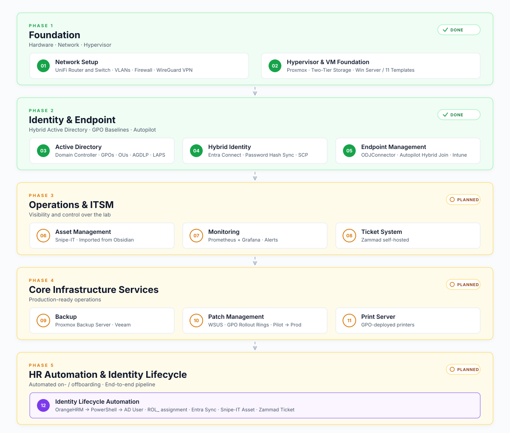
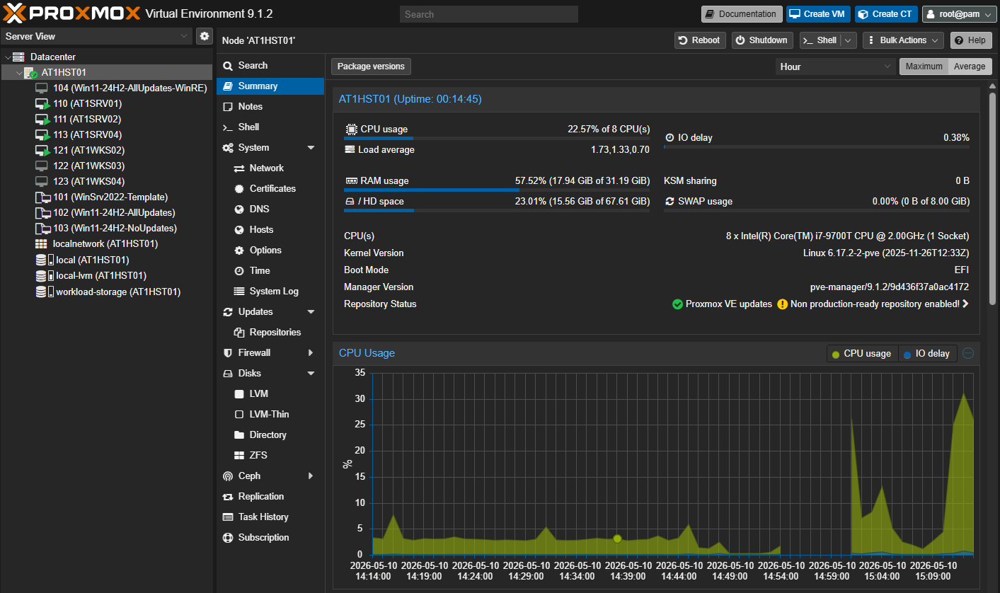
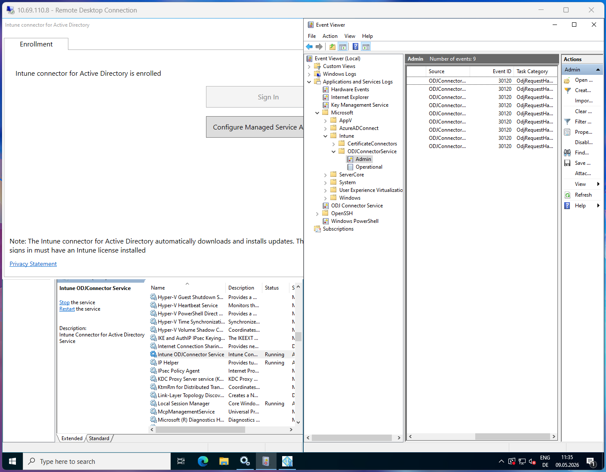
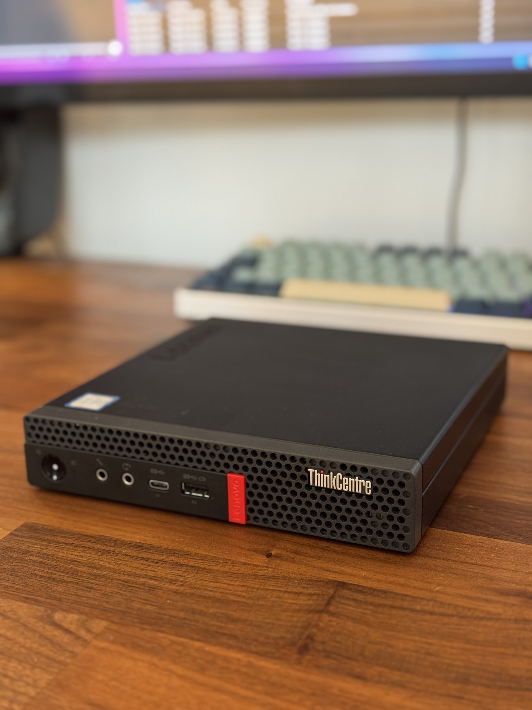

  
# MGMDZ - Corporate Homelab
"Man geht mit der Zeit oder man geht mit der Zeit"

A personal lab environment built to design, document, and operate an enterprise-style hybrid identity platform: 
**Active Directory**, Microsoft **Entra** & **Intune**, Windows **Autopilot**, **GPO**-based hardening, segmented **networking**

---

## Architecture and Roadmap

> The lab also runs separate VLANs for Home, IoT, Camera, and Guest networks. These are isolated from the corporate lab segments by default.

---

## Screenshots
<table style="width: 100%; border-collapse: collapse;">
  <tr>
    <td align="center" width="25%">
       
      <b>Proxmox Hypervisor - Virtual Machines</b>
    </td>
    <td align="center" width="25%">
       
      <b>Domain Controller - OUs and GPOs</b>
    </td>
    <td align="center" width="25%">
       
      <b>Entra Connect - Synchronization Service</b>
    </td>
    <td align="center" width="25%">
       
      <b>ODJ Connector - Event Viewer & Services</b>
    </td>
  </tr>
</table>

---

## What this lab demonstrates

- **Hybrid identity** — on-prem Active Directory ↔ Microsoft Entra ID via Entra Connect Sync
- **Windows Autopilot** in a Hybrid Azure AD Join scenario, fronted by an ODJ Connector
- **Structured AD design** — Top-Level-OU principle, AGDLP-style RBAC with `ROL_` / `PRM_` group prefixes, intentional sync-scope separation between `_CORP` and `_ADMIN`
- **Group Policy hardening** — domain baseline, LAPS with custom managed admin account, RDP hardening, workstation baseline, restricted-groups model
- **Network segmentation** — VLAN-based isolation between corporate, home, IoT, camera, and guest networks; WireGuard VPN with scoped access to the lab segment only
- **Documentation as infrastructure** — every layer is documented, versioned, and reviewable

Work in progress - additional features such as Asset Management (Snipe-IT), Monitoring (Prometheus + Grafana), Ticket System (Zammad), Backup (VEAAM), Patch Management (WSUS), Print Server,.. will be added over time.

---

## Environment

| Component | Spec |
|---|---|
| Host | Lenovo ThinkCentre M920q - `AT1HST01` |
| CPU | Intel i7-9700T  (8 cores) |
| RAM | 32 GB DDR4 SODIMM (2 × 16 GB) |
| Storage — Tier 0 | 256 GB NVMe → `local-lvm` |
| Storage — Tier 1 | 1 TB SSD → `workload-storage` |
| Hypervisor | Proxmox VE - `vmbr0` VLAN-aware |

 

---

## Tech stack

**Hypervisor & infra** · Proxmox VE · LVM-Thin · QEMU/KVM · UEFI/Q35  
**Identity** · Active Directory Domain Services · Microsoft Entra ID · Entra Connect Sync · Hybrid Azure AD Join  
**Endpoint management** · Windows Autopilot · Intune · ODJ Connector · Windows LAPS · Group Policy  
**Networking** · UniFi · VLANs · Firewall rules · WireGuard  
**OS** · Windows Server 2022 · Windows 11 Enterprise  
**Scripting** · PowerShell · Active Directory module · LAPS module  
**Documentation** · Markdown · Mermaid · Notion (asset DB) · Snipe-IT (planned)  

---

## Sources / Udemy Courses
[Mastering Active Directory](https://www.udemy.com/course/mastering-active-directory-mit-microsoft-windows-server)
 
[MD-102: Endpoint Administrator](https://www.udemy.com/course/md-102-endpoint-administrator-o)
 
[Proxmox Masterclass](https://www.udemy.com/course/proxmox-hands-on-masterclass-from-beginner-to-expert)

## Related repositories

- [Autopilot Hash Collection](https://github.com/goldsteynAT) — PowerShell tooling used in this lab to harvest hardware hashes for Autopilot registration

---

## Notes & disclaimer

This is a private learning environment.
Domain names (corp.lab), tenant identifiers, hostnames, IP addresses, GUIDs, and example users in this repository are fictional or have been adjusted for publication. No data, configuration, or material from any current or previous employer is used. Operational secrets — passwords, recovery keys, real tenant IDs, certificates, public IPs — are not present anywhere in this repository.

This is a private learning environment.

Domain names (`corp.lab`), tenant identifiers, hostnames, IP addresses, GUIDs, and example users in this repository are fictional or have been adjusted for publication. No data, configuration, or material from any current or previous employer is used. Operational secrets — passwords, recovery keys, real tenant IDs, certificates, public IPs — are not present anywhere in this repository.
